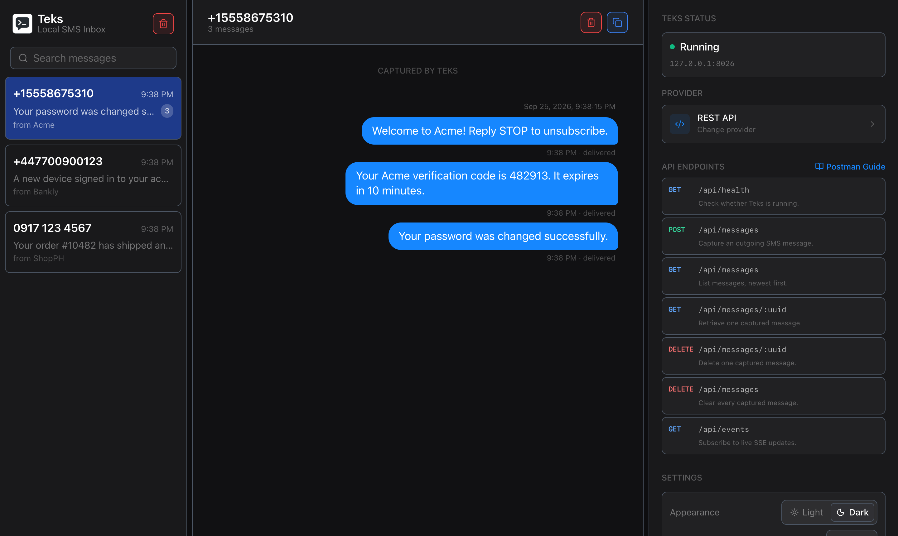

# Teks

**Local SMS testing for developers.** Teks catches the text messages your app sends and shows them
in a phone-style inbox on your machine. There's no carrier, no cost, and no real phones involved.

It's what [Mailpit](https://mailpit.axllent.org) is for email, but for SMS: point your app at
Teks while developing, and every OTP, alert, and notification lands in the inbox instead of
someone's phone.



## Why Teks

- **Works with the provider you already use.** Teks speaks the real APIs of Twilio and Semaphore,
  so your existing code and official SDKs work unchanged. Only the base URL changes.
- **Test OTP and verification flows** without buying numbers, burning credits, or waiting on a
  real phone.
- **See exactly what was sent.** Each message keeps its raw request payload, sender, status, and
  provider details for debugging.
- **Live inbox.** Messages appear the moment your app sends them, grouped into conversations
  by recipient.
- **One small binary.** No Docker, database server, or runtime to install. Messages are stored
  locally and nothing ever leaves your machine.

## Install

**macOS / Linux (Homebrew)**

```bash
brew install kentj-dev/tap/teks
```

**macOS / Linux (shell installer)**

```bash
curl --proto '=https' --tlsv1.2 -LsSf https://github.com/kentj-dev/teks/releases/latest/download/teks-installer.sh | sh
```

**Windows (PowerShell)**

```powershell
powershell -ExecutionPolicy Bypass -c "irm https://github.com/kentj-dev/teks/releases/latest/download/teks-installer.ps1 | iex"
```

## Quick start

Start Teks:

```bash
teks
```

The inbox opens at [http://127.0.0.1:8026](http://127.0.0.1:8026). Send it a message:

```bash
curl -X POST http://127.0.0.1:8026/api/messages \
  -H "Content-Type: application/json" \
  -d '{ "to": "+15558675310", "from": "MyApp", "message": "Your OTP is 123456" }'
```

It shows up in the inbox instantly. To capture your app's messages, point its SMS provider at
Teks as shown below.

## Supported providers

Pick a provider when Teks first opens, from **Change provider** in the inbox, or at startup
with `--provider`. The inbox's **Postman Guide** walks through every endpoint step by step.

| Provider | Start with | What your app changes |
|---|---|---|
| **REST API** (Teks' own) | `teks` | Send JSON to `/api/messages` |
| **Twilio** | `teks --provider twilio` | Base URL `https://api.twilio.com` → `http://127.0.0.1:8026` |
| **Semaphore** | `teks --provider semaphore` | Base URL `https://api.semaphore.co` → `http://127.0.0.1:8026` |

Want another provider? [Open an issue](https://github.com/kentj-dev/teks/issues).

### Twilio

Teks serves Twilio's Messages API on the same paths as `api.twilio.com`, following Twilio's
official OpenAPI spec. Responses, `SM…` SIDs, paging, and error codes match, so Twilio's SDKs
raise their normal exceptions. Any credentials are accepted and never stored.

```text
POST   /2010-04-01/Accounts/:AccountSid/Messages.json
GET    /2010-04-01/Accounts/:AccountSid/Messages.json
GET    /2010-04-01/Accounts/:AccountSid/Messages/:Sid.json
DELETE /2010-04-01/Accounts/:AccountSid/Messages/:Sid.json
```

Plain HTTP clients only need the new base URL. Twilio's SDKs have `api.twilio.com` built in,
so give them a small HTTP client that redirects requests in development:

```js
// Node
const twilio = require('twilio');

class TeksClient extends twilio.RequestClient {
  request(opts) {
    return super.request({ ...opts, uri: opts.uri.replace('https://api.twilio.com', 'http://127.0.0.1:8026') });
  }
}

const client = twilio(accountSid, authToken, { httpClient: new TeksClient() });
```

```python
# Python
from twilio.http.http_client import TwilioHttpClient
from twilio.rest import Client

class TeksHttpClient(TwilioHttpClient):
    def request(self, method, url, *args, **kwargs):
        url = url.replace("https://api.twilio.com", "http://127.0.0.1:8026")
        return super().request(method, url, *args, **kwargs)

client = Client(account_sid, auth_token, http_client=TeksHttpClient())
```

Not emulated yet: updating messages, media sub-resources, and status callbacks.

### Semaphore

Teks serves Semaphore's v4 API on the same paths. Any non-empty `apikey` is accepted, and it's
redacted before the message is stored.

```text
POST /api/v4/messages          GET /api/v4/messages
POST /api/v4/priority          GET /api/v4/messages/:id
POST /api/v4/otp               GET /api/v4/account
                               GET /api/v4/account/transactions
                               GET /api/v4/account/sendernames
                               GET /api/v4/account/users
```

```bash
curl --data "apikey=local&number=09171234567&message=Hello from Teks&sendername=MyApp" \
  http://127.0.0.1:8026/api/v4/messages
```

### REST API

Teks' own JSON API, for apps that don't use a specific provider or for scripting tests.

```text
POST   /api/messages         Capture a message
GET    /api/messages         List messages, newest first
GET    /api/messages/:uuid   Get one message
DELETE /api/messages/:uuid   Delete one message
DELETE /api/messages         Clear the inbox
GET    /api/events           Live updates (Server-Sent Events)
GET    /api/health           Health check
```

Only the selected provider's endpoints accept requests. Calls to another provider's endpoints
get a `409 Conflict` that says which provider is active.

## Usage

```text
teks [--host <HOST>] [--port <PORT>] [--no-open] [--provider <rest|semaphore|twilio>]
```

| Option | Default | Description |
|---|---|---|
| `--host` | `127.0.0.1` | Address to listen on |
| `--port` | `8026` | Port to listen on |
| `--no-open` | off | Don't open the inbox in a browser |
| `--provider` | `rest` | Which provider's API to enable |

Teks listens only on your machine by default and never contacts Twilio, Semaphore, or any other
service. Messages are kept in your user data folder between runs.

## Contributing

Bug reports, provider requests, and pull requests are welcome. See
[CONTRIBUTING.md](CONTRIBUTING.md) for development setup and how to add a provider.

## License

[MIT](LICENSE)
